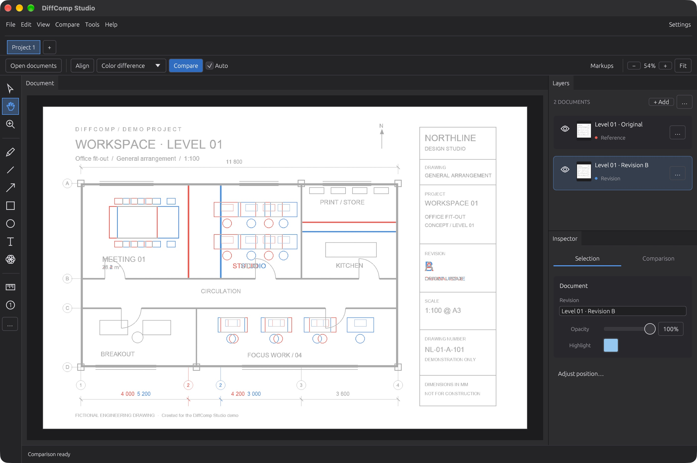
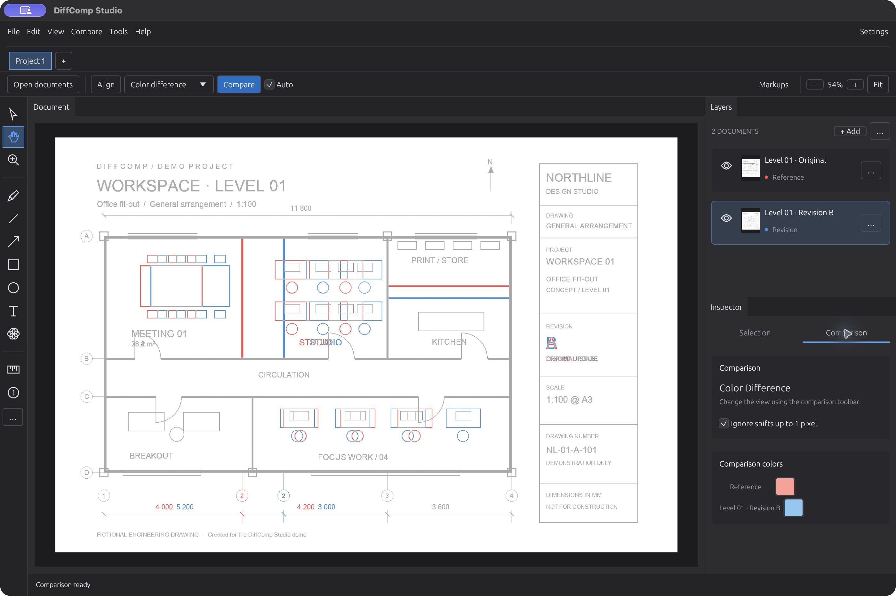

<div align="center">

# DiffComp Studio

**See what changed. Keep the drawing in focus.**

Document comparison for technical drawings, PDFs and images — built in Rust.

[](https://github.com/leonsuv/diffcomp-studio/actions/workflows/windows.yml)
[](https://github.com/leonsuv/diffcomp-studio/releases/latest)
[](https://www.rust-lang.org)

[**Download**](https://github.com/leonsuv/diffcomp-studio/releases/latest) · [Getting started](#getting-started) · [Build from source](#build-from-source)

</div>



## A workspace designed around the document

A large canvas, a persistent tool rail and a contextual inspector keep the comparison easy to read. Reference content stays neutral; removed and added details use distinct colors. Choose your own colors for each revision.

- **Compare PDF and raster documents:** PDF, PNG, JPEG, TIFF and BMP.
- **Review multiple revisions:** compare visible layers against a reference, preserving document coordinates and offsets.
- **Choose the right view:** color difference, overlay, heatmap, binary mask, subtraction or XOR.
- **Align drawings:** automatic alignment plus optional manual position adjustment.
- **Mark up changes:** pen, shapes, arrows, text, clouds, measurements and counts.
- **Stay in context:** the inspector follows the selected document, markup or drawing tool. Comparison options have a separate tab.
- **Keep projects together:** project tabs, undo/redo and saved comparison sessions.



## Downloads

Get the packaged builds from [Releases](https://github.com/leonsuv/diffcomp-studio/releases/latest).

| Platform | Package | Notes |
| --- | --- | --- |
| Windows x64 | Portable ZIP and standalone EXE | Includes the C runtime; no OpenCV or PDFium installation. |
| macOS Apple Silicon | Application ZIP | Local ad-hoc signature; not Apple-notarized. |
| Browser | Web build ZIP | Serve over HTTP/HTTPS; large CPU operations can temporarily pause interaction. |

Windows packages are built on a Windows runner. The workflow runs the workspace tests and checks the shipped EXE's version, native window creation and responsiveness with a comparison session. The accompanying runtime report records the executable's SHA-256.

## Getting started

1. Open or drop the original and revised documents into the canvas.
2. The first document becomes the reference. Use a layer's menu to change it.
3. Click **Align** when the pages need alignment, then choose a comparison view.
4. Click **Compare**, or leave **Auto** enabled to update changes automatically.
5. Use **Fit**, pan and zoom to review details. Select a markup tool to annotate the document.
6. Save the project as a `.dcs` session.

**Useful shortcuts:** `Ctrl/Cmd+O` opens documents, `H` selects the hand tool, `V` selects objects, `Z` selects zoom and `F` fits the document. Hold Alt while using the zoom tool to zoom out.

Structural color comparison can ignore shifts up to one pixel. It runs on the CPU; explicit graphics-processor mode uses pixel comparison. Background work on desktop keeps imports, alignment and comparison processing away from the interface thread.

## Build from source

Use a current stable Rust toolchain. The workspace declares Rust 1.85 as its minimum; locked dependencies may require a newer stable compiler.

```sh
cargo run --locked --release -p dc_app --bin diffcomp-studio
cargo test --workspace --locked
cargo fmt --all --check
```

Image decoding, PDF rendering and alignment use Rust libraries. OpenCV and PDFium are not required. Native builds still need the platform's normal windowing and graphics development environment.

### Windows

Run from PowerShell with the Rust MSVC toolchain and Visual Studio C++ build tools installed:

```powershell
./scripts/bundle-windows.ps1
cargo run --locked -p dc_app --example showcase_session -- dist/windows/showcase.dcs
./scripts/verify-windows.ps1 -Executable ./dist/windows/DiffComp-Studio/diffcomp-studio.exe -Session ./dist/windows/showcase.dcs
```

### macOS

```sh
bash scripts/bundle-macos.sh
# dist/macos/DiffComp Studio.app
```

The script uses ad-hoc signing by default. Set `DIFFCOMP_SIGN_IDENTITY` to use your own signing identity.

### Browser

```sh
cargo install trunk --locked
bash scripts/build_wasm_release.sh
# crates/dc_app/dist
```

### Reproduce the screenshots

The fictional engineering drawings in `docs/demo` are included for demonstrations and startup tests.

```sh
cargo run --locked -p dc_app --example showcase_session -- /tmp/showcase.dcs
cargo run --locked -p dc_app --bin diffcomp-studio -- --session /tmp/showcase.dcs
```

## Engineering notes

- Immutable raster buffers are shared between jobs and undo snapshots.
- Comparisons handle multiple revisions, transparent backgrounds, document sizes and layer offsets.
- Obsolete asynchronous results are discarded; results stay with their owning project.
- Session writes are atomic. Sessions retain aligned images and embed snapshots and other memory-only layers. Keep original disk documents available for sessions that reference them.
- The synthetic 4096 × 4096 structural comparison improved from 54.2 ms to 43.1 ms on the development Mac, about 20%. This measures the comparison kernel, excluding decoding, alignment and display.

```sh
cargo run --locked --release -p dc_core --example diff_bench
```

| Crate | Responsibility |
| --- | --- |
| `dc_app` | Interface, project state, sessions, annotations and undo |
| `dc_core` | Loaders, raster data, alignment and CPU comparison |
| `dc_gpu` | Tiled GPU comparison and compute shaders |
| `dc_license` | Offline license verification |
| `dc_keygen` | Internal license tooling |

Run with `RUST_LOG=debug` for diagnostic logs. `diffcomp-studio --version` reports the version without opening a window.
